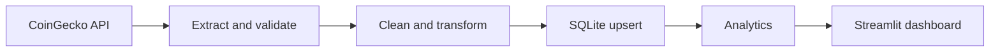

# Real-Time Crypto Analytics Platform

An interactive cryptocurrency analytics dashboard built with **Python, Streamlit,
Plotly, and SQLite**. The platform fetches market data from CoinGecko, processes it
through an ETL pipeline, and turns stored market snapshots into charts, rankings,
and summary metrics.

**[Open the Live Dashboard](https://real-time-crypto-analytics-platform-axuqpnotjnurzdnuyfvexv.streamlit.app/)**

[Source Code](https://github.com/khairbakshnoor-pixel/Real-Time-Crypto-Analytics-Platform)
| [Local Setup](#local-setup)
| [Project Structure](#project-structure)

## Project Overview

This project demonstrates an end-to-end data engineering workflow: extracting API
data, cleaning records, storing them in a relational database, and presenting
analytics through a web application. Each API request retrieves the top 20 coins
by market capitalization, with prices and market values denominated in USD.

Updates use periodic polling rather than a continuous streaming feed. The
dashboard shows the stored snapshot timestamp so viewers can check data freshness.

## Features

- **Market summary:** tracked market capitalization, average market capitalization,
  highest 24-hour price change, and the coin with the highest volatility score.
- **Interactive charts:** top five coins by market capitalization, highest
  24-hour percentage changes, and volatility ranking.
- **Market data table:** inspect prices, symbols, trading volumes, ranks,
  calculated scores, and extraction timestamps.
- **Adjustable display refresh:** choose an interval from 10 to 120 seconds;
  the default is 60 seconds.
- **Integrated ETL:** initialize the database and fetch data from the dashboard
  without starting a separate worker.
- **Failure handling:** retain stored data and display a warning when an API
  update fails; API requests have a 20-second timeout.
- **Optional scheduled worker:** run ETL independently every five minutes and
  save raw API responses as JSON.

## Technology Stack

| Technology | Role |
| --- | --- |
| Python | Application and ETL logic |
| Streamlit | Dashboard, controls, caching, and timed refresh |
| Plotly | Interactive data visualizations |
| Pandas | SQL query results and analytical data processing |
| SQLite | Local storage with one record per coin ID |
| Requests | CoinGecko HTTP requests |
| APScheduler | Optional standalone ETL scheduling |
| Streamlit Community Cloud | Live dashboard hosting |

## How It Works



1. **Extract:** request market data from CoinGecko's `/coins/markets` endpoint
   and validate the HTTP response and returned records.
2. **Transform:** convert numeric fields, handle missing numeric values, calculate
   a volatility score, and attach a UTC extraction timestamp.
3. **Load:** insert new coins or update existing records using the unique `coin_id`.
4. **Analyze:** calculate summary metrics and rank stored coins.
5. **Display:** render charts and a data table, refreshing while a session is active.

### Refresh Behavior

The display refresh interval and API update interval are separate. The sidebar
controls how often the dashboard redraws. API attempts are cached for five minutes
across sessions, including failed attempts, to limit repeated requests. The next
active refresh after cache expiry attempts a new update.

## Project Structure

```text
Real-Time-Crypto-Analytics-Platform/
|-- dashboard.py          # Streamlit interface and cached updates
|-- extract.py            # CoinGecko requests and optional raw JSON export
|-- transform.py          # Cleaning, numeric conversion, and volatility score
|-- load.py               # SQLite inserts and updates
|-- database.py           # Database path, connections, and table initialization
|-- analysis.py           # Market queries and rankings
|-- etl_pipeline.py       # ETL orchestration and standalone scheduler
|-- verify_dashboard.py   # Analysis smoke-check script
|-- tests/
|   `-- test_pipeline.py  # ETL and dashboard regression tests
|-- raw_data/             # Saved API response samples
|-- crypto.db             # Bundled historical market snapshot
|-- requirements.txt      # Python dependencies
|-- .gitignore
`-- README.md
```

## Local Setup

### 1. Clone the Repository

```sh
git clone https://github.com/khairbakshnoor-pixel/Real-Time-Crypto-Analytics-Platform.git
cd Real-Time-Crypto-Analytics-Platform
```

### 2. Create a Virtual Environment

Use Python 3.12 or newer:

```sh
python -m venv .venv
```

Windows PowerShell:

```powershell
.venv\Scripts\Activate.ps1
```

macOS or Linux:

```sh
source .venv/bin/activate
```

### 3. Install Dependencies and Start the App

```sh
python -m pip install -r requirements.txt
python -m streamlit run dashboard.py
```

Open the local URL printed by Streamlit, normally `http://localhost:8501`.
The dashboard creates its database table automatically and attempts a market
update on first load. No PostgreSQL installation or database credentials are needed.

### Optional: Run the Standalone ETL Worker

```sh
python etl_pipeline.py
```

The worker runs immediately, then every five minutes, and saves raw JSON in
`raw_data/`. It is unnecessary for the normal Streamlit workflow. Stop it with
`Ctrl+C`.

## Data and Metrics

The `crypto_market` table stores these fields:

| Fields | Description |
| --- | --- |
| `id`, `coin_id` | Internal row ID and unique CoinGecko coin ID |
| `symbol`, `name` | Coin identity |
| `current_price` | Current price in USD |
| `market_cap`, `total_volume` | Market capitalization and reported volume in USD |
| `price_change_24h` | Price change percentage over 24 hours |
| `market_cap_rank` | Market capitalization rank returned by the API |
| `volatility_score` | Absolute 24-hour percentage change multiplied by volume |
| `extracted_at` | Extraction timestamp; new updates use UTC |

The volatility score is a custom ranking metric, not statistical historical
volatility. Market capitalization totals cover stored coins only, not the entire
crypto market. The database updates records in place and does not retain a
price-history time series. Coins from earlier requests can remain stored if they
are absent from a later API response.

## Streamlit Community Cloud

Live application:
**[Real-Time Crypto Analytics Platform](https://real-time-crypto-analytics-platform-axuqpnotjnurzdnuyfvexv.streamlit.app/)**

To deploy your own instance:

1. Push the project files to GitHub.
2. Create a Streamlit Community Cloud app for
   `khairbakshnoor-pixel/Real-Time-Crypto-Analytics-Platform`, branch `main`.
3. Set the entrypoint to `dashboard.py` and select Python 3.12 or newer.
4. Deploy; dependencies are installed from `requirements.txt`.

No secrets are required by this version. The public CoinGecko endpoint may
rate-limit or reject requests; the app reports failures and keeps stored data.
SQLite lives beside `database.py`, independent of the working directory.
Set `CRYPTO_DB_PATH` to override it; the parent directory must already exist.
Cloud local storage is ephemeral, so restarts/redeployments may reset data.
Persistent external storage is needed for historical retention.

## Verification

```sh
python -m unittest discover -s tests -v
python verify_dashboard.py
```

The automated tests cover fresh database initialization, coin updates, missing
numeric values, API response validation, failed updates, and dashboard rendering
with empty and populated data. The smoke-check script prints analysis results
from the current database.

## Troubleshooting

| Issue | What to Check |
| --- | --- |
| Market update warning | Check internet access and application logs. API failures are cached for five minutes before another attempt. |
| Old snapshot timestamp | The bundled data is historical; a successful API update is needed for fresh values. |
| Database unavailable | Ensure the database location is writable and any custom parent directory exists. |
| Missing Python module | Activate the virtual environment and install `requirements.txt`. |
| Data resets after cloud restart | Local cloud storage is ephemeral; use external persistent storage for retention. |

## Author

**Khair Baksh Noor**

[GitHub Profile](https://github.com/khairbakshnoor-pixel)

## References

- [CoinGecko API](https://www.coingecko.com/en/api)
- [Streamlit Deployment Dependencies](https://docs.streamlit.io/deploy/streamlit-community-cloud/deploy-your-app/app-dependencies)
- [Streamlit Timed Fragments](https://docs.streamlit.io/develop/api-reference/execution-flow/st.fragment)
